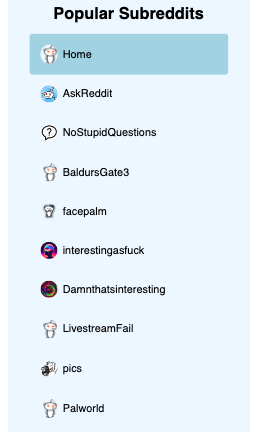
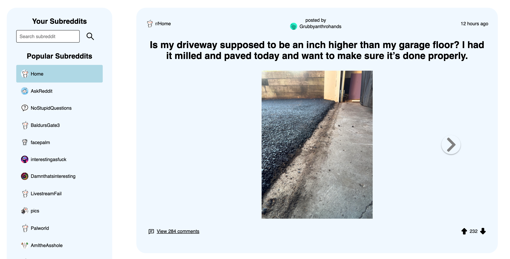
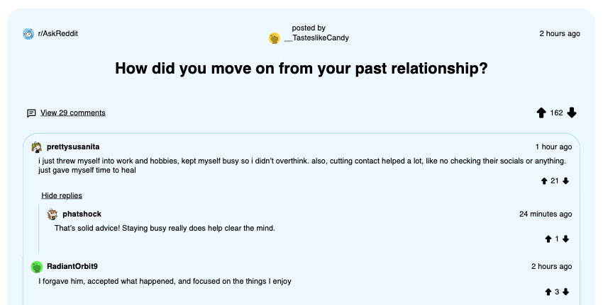
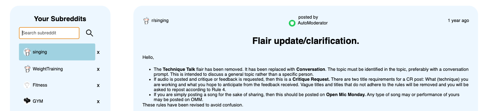
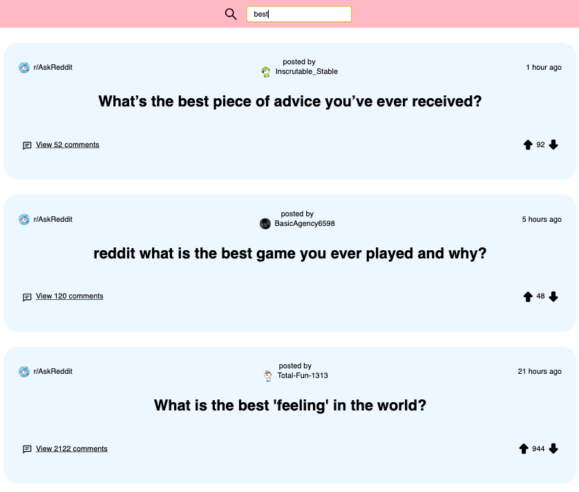

# Reddit Lite

Reddit Lite is a read-only web application that utilizes the .json endpoints of the Reddit API and allows users to browse the most popular subreddits and posts from Reddit, with the option to search and add custom subreddits to your personal menu. The app is simple, lightweight, and focused purely on consuming Reddit content without distractions.

---

## Table of Contents
- [Features](#features)
- [Technologies and Tools](#technologies-and-tools)
- [Installation](#installation)
- [License](#license)

---

## Features

- **Subreddit Menu**: The subreddit menu includes Reddit's most popular subreddits.
  
  
- **Popular Posts & Comments**: Click on any subreddit to view its top posts.
  

- **Comments and Replies of Comments on Posts**: Click to load comments and their replies.
 

- **Search for Custom Subreddits**: Use the search feature to find and add custom subreddits to your menu.
  

- **Filter Posts by Keyword**: Use the top search feature to filter posts based on keywords.


- **Read-Only Experience**: Reddit Lite is focused on reading, with no posting or voting capabilities, making it perfect for passive browsing.

---

## Technologies and Tools

- [React](https://reactjs.org/)
- [Redux](https://redux.js.org/)
- [JavaScript](https://developer.mozilla.org/en-US/docs/Web/JavaScript)
- [CSS3](https://www.w3.org/TR/CSS/)
- [Netlify](https://www.netlify.com/)

---

## Installation

To get Reddit Lite up and running locally, follow these steps:

1. **Clone the repository**:
    ```bash
    git clone https://github.com/rocklyn-r/reddit-app.git
    cd reddit-lite
    ```

2. **Install dependencies**:
    Make sure you have [Node.js](https://nodejs.org/) installed, then run:
    ```bash
    npm install
    ```

3. **Run the application**:
    ```bash
    npm start
    ```

4. **Open the app**:
    Once the application is running, you can open it in your browser at:
    ```
    http://localhost:3000
    ```

---